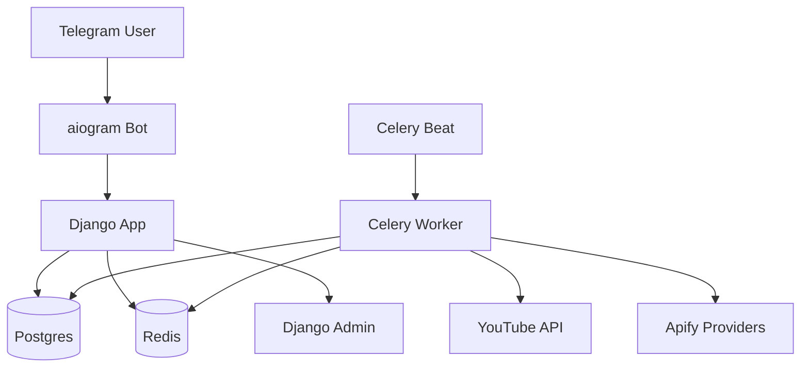

# Competitor Spy

Self-hosted Telegram bot for tracking competitor content across YouTube, TikTok, and Instagram.

Competitor Spy is a self-hosted Django, Celery, Redis, Postgres, and aiogram application for creators, agencies, indie hackers, and small marketing teams that want scheduled competitor-content trend reports in Telegram.

This project is not affiliated with YouTube, TikTok, Instagram, Telegram, Apify, OpenAI, or their parent companies. Self-hosters are responsible for complying with platform terms, API limits, and local law.

## Why this exists

Most content teams still check competitors manually: open each profile, scan recent videos, compare views by memory, and paste notes into chat. Competitor Spy turns that workflow into a repeatable self-hosted bot:

1. add your own profile and competitors,
2. collect public metrics on a schedule,
3. compare each new item against that competitor's own baseline,
4. receive a concise Russian-language Telegram report with the outliers worth studying.

It is built as a practical OSS reference for Telegram bot onboarding, Django Admin operations, Celery scheduling, provider adapters, baseline-relative scoring, and public-safe maintainer automation.

## What it does

- Accepts a creator profile URL, `@handle`, or plain handle in Telegram.
- Infers niche keywords from profile metadata and recent content.
- Discovers YouTube competitors during setup and lets users remove irrelevant channels.
- Tracks explicit TikTok and Instagram competitors through provider integrations.
- Collects content metrics into shared global snapshots.
- Scores items against each competitor's recent baseline.
- Sends scheduled Russian-language Telegram reports with YouTube, TikTok, and Instagram sections.
- Exposes users, competitors, reports, schedules, and job runs in Django Admin.

## Who it is for

- Creators looking for repeatable content ideas.
- Small agencies monitoring client niches.
- Developers building Telegram bot plus Django/Celery workflows.
- Teams that prefer self-hosted content-intelligence tooling.
- Maintainers interested in provider adapters, reporting pipelines, and scheduled jobs.

## Features

- Docker-first local setup.
- aiogram Telegram bot with Russian UI/messages.
- Django Admin for inspection and operations.
- Celery worker and Celery Beat for collection and scheduled reporting.
- YouTube channel resolving, discovery, collection, scoring, and reports.
- TikTok and Instagram provider abstraction with Apify-backed collection support.
- Shared content and metric snapshots across users.
- JobRun records for task observability.
- pytest test suite and GitHub Actions CI.
- Optional maintainer automation under `tools/`; OpenAI is not required for core runtime.

## Demo paths

- [Demo script](./docs/demo-script.md): five-minute walkthrough for maintainers, reviewers, or potential contributors.
- [Public launch checklist](./docs/public-launch-checklist.md): release and promotion readiness checklist.
- [Promotion kit](./docs/promotion-kit.md): short descriptions, social posts, and community-submission copy.

## Architecture



## Quick start with Docker

Run from the repository root:

```bash
cp .env.example .env
docker compose up -d --build
docker compose exec web python manage.py migrate
docker compose exec web python manage.py createsuperuser
docker compose exec web pytest
```

Open Django Admin at `http://localhost:8000/admin/`.

`createsuperuser` creates a Django Admin login. It is not related to Telegram.

## Docker image

After this workflow is merged, new pushes to `main` and new `v*` tags publish a container image to GitHub Container Registry:

```bash
docker pull ghcr.io/kirillsaven/competitors_spy:<published-tag>
```

For local development, `docker compose up -d --build` remains the recommended path because it starts Postgres, Redis, web, bot, worker, and beat together.

## Configuration

Copy `.env.example` to `.env` and fill only the credentials you need. Do not commit `.env`.

Required for the full bot:

- `DJANGO_SECRET_KEY`
- `DATABASE_URL`
- `REDIS_URL`
- `TELEGRAM_BOT_TOKEN`
- `YOUTUBE_API_KEY` or `YOUTUBE_API_KEYS`

Useful defaults and limits:

- `BASELINE_N`
- `BASELINE_WINDOW_DAYS`
- `YT_RECENT_N_FOR_METRICS`
- `MAX_COMPETITORS_PER_PLATFORM`
- `MIN_DELTA_VIEWS`
- `MIN_VIEWS_END`

Provider credentials and bot tokens belong in `.env` or your deployment secret manager, never in source control or public issues.

## Provider setup

### YouTube

Set:

```env
YOUTUBE_API_KEY=your-youtube-api-key
```

or provide a comma-separated key pool:

```env
YOUTUBE_API_KEYS=key-one,key-two
```

YouTube is the only MVP platform with automatic competitor discovery during setup. The app prefers cheaper YouTube Data API calls and uses `search.list` only for discovery or fallback resolving.

### TikTok via Apify

Set:

```env
TIKTOK_PROVIDER=apify
TIKTOK_PROVIDER_ACCESS_TOKEN=your-apify-token
```

Optional:

```env
TIKTOK_PROVIDER_BASE_URL=https://api.apify.com/v2
TIKTOK_APIFY_PROFILE_ACTOR_ID=clockworks/tiktok-profile-scraper
TIKTOK_APIFY_SEARCH_ACTOR_ID=clockworks/tiktok-user-search-scraper
TIKTOK_APIFY_RESULTS_PER_PROFILE=10
```

TikTok competitors are added from explicit links or handles.

### Instagram via Apify

Set:

```env
INSTAGRAM_PROVIDER=apify
INSTAGRAM_PROVIDER_ACCESS_TOKEN=your-apify-token
```

Optional:

```env
INSTAGRAM_PROVIDER_BASE_URL=https://api.apify.com/v2
INSTAGRAM_APIFY_PROFILE_ACTOR_ID=apify/instagram-profile-scraper
INSTAGRAM_APIFY_SEARCH_ACTOR_ID=iron-crawler/instagram-search-users
```

Instagram competitors are added from explicit links or handles.

## Running reports

Run a report immediately for a Telegram user:

```bash
docker compose exec web python manage.py run_user_report <tg_user_id>
```

Verify live TikTok and Instagram report sections locally with real provider data:

```bash
docker compose exec web python manage.py verify_live_platform_report \
  --tiktok https://www.tiktok.com/@example \
  --instagram https://www.instagram.com/example/
```

Send a live test report to Telegram:

```bash
docker compose exec web python manage.py send_test_platform_report \
  --tg-user-id <YOUR_TELEGRAM_USER_ID> \
  --tg-chat-id <YOUR_TELEGRAM_CHAT_ID> \
  --tiktok https://www.tiktok.com/@example \
  --instagram https://www.instagram.com/example/
```

Use only your own test chat/user IDs.

## Development

Install dependencies locally if you are not using Docker:

```bash
python -m pip install -r requirements.txt
python manage.py migrate
python manage.py check
pytest -q
```

The Docker path is the preferred reproducible setup because it includes Postgres, Redis, the bot, worker, and beat services.

## Testing

Run:

```bash
pytest -q
python manage.py check
python manage.py check --deploy --fail-level WARNING
```

CI uses fake safe environment values and must not require real YouTube, Telegram, Apify, or OpenAI credentials.

## Production deployment

See [DEPLOY.md](./DEPLOY.md) for a generic Docker Compose deployment template.

Production deployments should use HTTPS, a strong `DJANGO_SECRET_KEY`, private environment variables, a real domain in `DJANGO_ALLOWED_HOSTS`, and a reverse proxy. Never expose Django's development server directly to the public internet.

## Security model

- Users do not log into social networks through this app.
- Users provide public profile URLs or handles.
- Platform credentials are configured by the self-hoster.
- Shared snapshots are stored once per platform content item.
- Reports and Telegram identifiers are operational data and should be protected like application data.
- AI-related maintainer tooling is optional and separate from core runtime.

## Public release safety

- No secrets should be committed to the repository.
- `.env` is ignored.
- Use `.env.example` for documented placeholders only.
- Rotate tokens immediately if they are accidentally exposed.
- Report vulnerabilities privately using [SECURITY.md](./SECURITY.md).
- Do not paste real bot tokens, API keys, database URLs, Telegram IDs, or private server details into issues.

## Limitations

- YouTube is the most complete MVP provider.
- TikTok and Instagram support depends on configured provider behavior and returned public metrics.
- Platform APIs, provider actors, and rate limits can change.
- Scoring is heuristic and baseline-relative; it is intended for trend discovery, not guaranteed business advice.
- The project does not provide hosted infrastructure.

## Why open source?

Competitor Spy is open source to help developers learn Telegram bot, Django, Celery, Redis, Postgres, and provider integration patterns in a real workflow. It provides a useful self-hosted competitor-tracking baseline and invites improvements to provider integrations, report quality, deployment hardening, and security review.

If the project helps you or gives you a useful implementation reference, a GitHub star helps other developers discover it.

## Roadmap

See [ROADMAP.md](./ROADMAP.md).

## Contributing

See [CONTRIBUTING.md](./CONTRIBUTING.md).

## License

MIT. See [LICENSE](./LICENSE).
